<!-- README.md is generated from README.Rmd. Please edit that file -->

# gamworkshop

<!-- badges: start -->

<!-- badges: end -->

The goal of gamworkshop is to …

``` r
library(gamworkshop)
library(pacman)

p_load(data.table,tidyverse,knitr,splines,ggfortify,mgcv,ggrepel,mgcViz)

stage_knots_in_age <- c(27/365,1,2,5,11,18,21)

theme_set(theme_bw(base_size = 16) + theme(text = element_text(face="bold")))
```

# Punchline

GAM \> GLM \> Logistic Regression for understanding nonlinear
relationships.

# Introduction

Oftentimes we want to model the relationship between a characteristic
and an outcome. In my work, I want to evaluate a characteristic’s
relationship to the outcome in a way that doesn’t bias the type of
relationship it naturally may have. In this tutorial, I will show how
generalized additive models are a flexible yet interpretable way to
model relationships in a population and have advantages over
traditionally used methods.

# Outline

  - Question
    
      - Setup the question to be investigated.

  - Data
    
      - Display the data to be used to answer the question

  - Relationship between outcome and characteristic
    
      - Show different ways of visualizing the data as well as the
        relationship between the outcome and characteristic.

  - Modeling
    
      - Different modeling strategies to investigate the relationship.
        Each strategy or method will be generally explained with
        examples.
    
      - Logistic Regression
    
      - Regression Spline
    
      - Generalized Additive Model

# Question

Which population model is quantitatively better at associating an
adverse event with a drug during child development i.e. along child
developmental stages?

[Child developmental
stages](https://www.researchgate.net/profile/Katrina_Williams8/publication/230612139/figure/tbl2/AS:601671696650242@1520461119208/Age-Stages-Defined-According-to-NICHD-Pediatric-Terminology.png)

# Data

``` r

data("report_dat") 
report_dat$D <- factor(report_dat$D,levels=c("Other drugs","Drug"))
report_dat$E <- factor(report_dat$E,levels=c("Other events","Event"))

report_dat <- 
  report_dat %>% 
  .[order(age)]

stages = c("term_neonatal","infancy","toddler","early_childhood","middle_childhood","early_adolescence","late_adolescence")
report_dat$nichd <- factor(report_dat$nichd,levels=stages)
report_dat$nichd_int <- report_dat$nichd %>% as.integer()

report_dat[1:5] %>% 
    kable("simple")
```

| safetyreportid |       age | year | nichd          | D           | E            | Dstate | Estate | nichd\_int |
| :------------- | --------: | ---: | :------------- | :---------- | :----------- | -----: | -----: | ---------: |
| 5826490-5      | 0.0001142 |    0 | term\_neonatal | Other drugs | Other events |      0 |      0 |          1 |
| 6329603-4      | 0.0001142 |    0 | term\_neonatal | Other drugs | Other events |      0 |      0 |          1 |
| 8764023        | 0.0001142 |    0 | term\_neonatal | Other drugs | Other events |      0 |      0 |          1 |
| 8764680        | 0.0001142 |    0 | term\_neonatal | Other drugs | Other events |      0 |      0 |          1 |
| 8764925        | 0.0001142 |    0 | term\_neonatal | Other drugs | Other events |      0 |      0 |          1 |

# Relationship between Paranoia and report characteristics

``` r

report_dat[,.N,.(D,E,year)] %>% 
  ggplot(aes(year,N)) +
  geom_point() +
  geom_line() +
  facet_grid(E~D) +
  scale_y_continuous(trans="log10",label=scales::comma) +
  ylab("Number of reports") +
  xlab("Age")
```

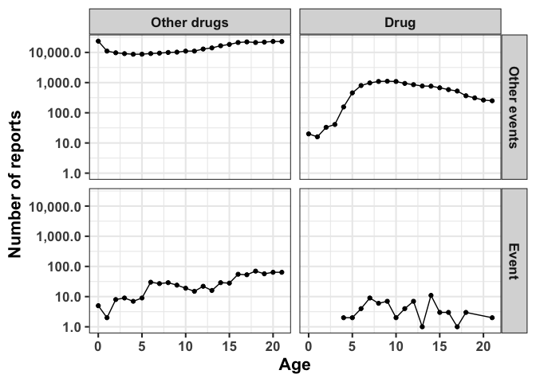

``` r

report_dat[,.N,.(nichd,D,E)] %>% 
  ggplot(aes(N,nichd)) +
  geom_bar(stat="identity") +
  geom_text_repel(aes(label=N),nudge_x=0.1) +
  facet_grid(D~E,scales="free") +
  scale_x_continuous(trans="log10",label=scales::comma) +
  xlab("Number of reports") +
  ylab("")
```

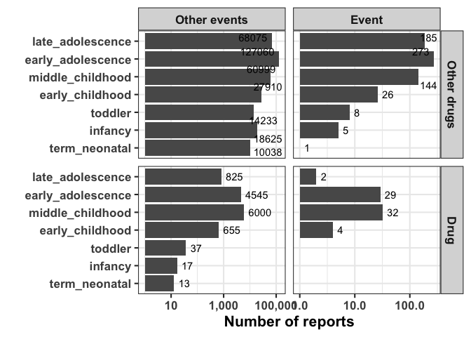

``` r

tab <- report_dat[,table(D,E)]
prr <- 
  (tab["Drug","Event"] / ( tab["Drug","Event"] + tab["Drug","Other events"] ) ) / 
  (tab["Other drugs","Event"] / (tab["Other drugs","Event"] + tab["Other drugs","Other events"]) )
prr
#> [1] 2.811654

tab <- report_dat[,table(D,E)]
prr <- function(tab){
  
  (tab["Drug","Event"] / ( tab["Drug","Event"] + tab["Drug","Other events"] ) ) / 
  (tab["Other drugs","Event"] / (tab["Other drugs","Event"] + tab["Other drugs","Other events"]) )
  
}

prr(tab)
#> [1] 2.811654

prr_df <- 
data.table(
  nichd = stages,
  PRR = sapply(stages,function(x){prr(report_dat[nichd==x,table(D,E)])})
) 

prr_df %>% 
  ggplot(aes(factor(nichd,levels=stages),PRR)) +
  geom_bar(stat="identity") +
  xlab("")
```

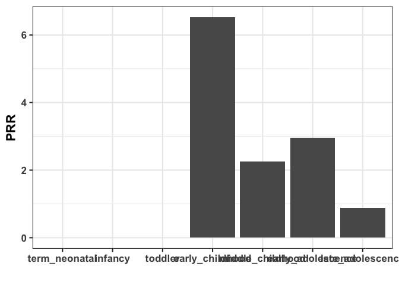

# Modeling

## Logistic Regression

``` r

glm_coef <- function(form="E ~ D - 1",id="id"){
    formula=as.formula(form)
    mod <- glm(formula,data=report_dat,family=binomial(link="logit"))
    summ <- summary(mod)
    dt <- summ$coefficients %>% data.table()
    dt$formula <- form
    dt$term <- summ$coefficients %>% rownames() %>% str_replace("D","") %>% str_replace("nichd",'')
    dt$id=id
    dt$aic <- mod$aic
    dt
}

glm_coefs <- 
    bind_rows(
        glm_coef("E ~ D",id='model1'),
        glm_coef("E ~ nichd",id='model2'),
        glm_coef("E ~ D + nichd",id='model3'),
        glm_coef("E ~ D*nichd",id='model4')
        )

glm_coefs$size = ifelse(stringr::str_detect(glm_coefs$term,":"),2,1)

glm_coefs %>% 
  ggplot(aes(formula,Estimate,color=term,group=term)) +
  geom_point(aes(size=size)) +
  geom_line() +
  scale_size(guide="none")
```


``` r

glm_coefs[,.(nterms = .N),.(formula,aic)] %>% 
  ggplot(aes(formula,aic)) +
  geom_point(size=4) +
  ylab("AIC")
```

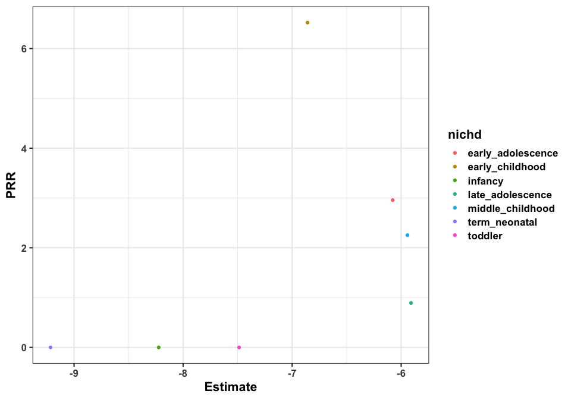

``` r


age_coef <- glm_coef("E ~ age",id='model2')[term=="age",Estimate]
age_coef2 <- glm_coef("E ~ age + D",id='model2')[term=="age",Estimate]

age_grid <- seq(0,21)


data.table(Age = age_grid,`E ~ age` = age_coef*age_grid,`E ~ age + D` = age_coef2*age_grid) %>% 
    pivot_longer(cols=c("E ~ age","E ~ age + D")) %>% 
    ggplot(aes(Age,value,color=name)) +
    geom_point() +
    geom_line() +
    guides(color=guide_legend(title="Model formula")) +
    xlab("Age") +
    ylab("Risk of Event")
```


## Polynomial Regression

``` r
# http://www.science.smith.edu/~jcrouser/SDS293/labs/lab12-r.html
fit_plot_polynomial <- function(degree=3){
    fit = glm(Estate ~ poly(age, degree), data = report_dat)
    preds = predict(fit, newdata = list(age = age_grid), se = TRUE)
    pfit = exp(preds$fit) / (1+exp(preds$fit))
    se_bands_logit = cbind("upper" = preds$fit+2*preds$se.fit, 
                           "lower" = preds$fit-2*preds$se.fit)
    se_bands = exp(se_bands_logit) / (1+exp(se_bands_logit))
    
    E = report_dat[E=="Event"]
    
    notE = report_dat[E=="Other events"]
    
    coefs = sapply(coef(fit)[2:(degree+1)],function(x){round(x,2)})
    formula = 
        paste0("Event ~ ",paste0(sapply(1:degree,function(x){paste0(coefs[x]," * age^",x)}),collapse=" + "))
    
    ggplot() +
      geom_rug(data = notE, aes(x = jitter(age), y = max(pfit)), sides = "b", alpha = 0.1) +
      geom_rug(data = E, aes(x = jitter(age), y = min(pfit)), sides = "t", alpha = 0.1) +
      geom_line(aes(x = age_grid, y = pfit), color = "#0000FF") +
      geom_ribbon(aes(x = age_grid, 
                      ymin = se_bands[,"lower"], 
                      ymax = se_bands[,"upper"]), 
                  alpha = 0.3) +
      labs(title = paste0(formula,"\nAIC=",round(fit$aic,0)),
           x = "Age",
           y = "P(Event)")
}

fit_plot_polynomial(1)
```


``` r
fit_plot_polynomial(2)
```

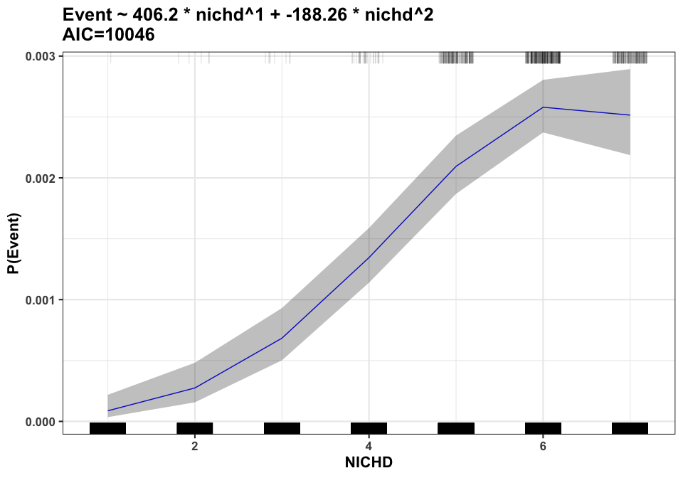

``` r
fit_plot_polynomial(3)
```


``` r
fit_plot_polynomial(4)
```


``` r
fit_plot_polynomial(5)
```


``` r
fit_plot_polynomial(6)
```


``` r
fit_plot_polynomial(7)
```

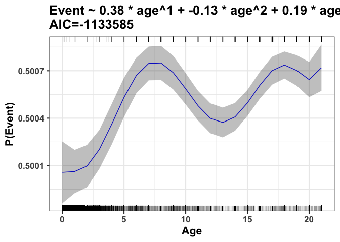

## Regression splines

``` r

# Simon Wood's Intro to GAMs textbook chapter 4

tf <- function(x,xj,j){
    ## generate the jth tent function from set defined by knots xj
    dj <- xj*0;dj[j] <- 1
    ## linearly interpolates between xj and dj taking place at x
    approx(xj,dj,x)$y
}

tf.X <- function(x,xj){
    ## tent function basis matrix given data X
    ## and knot sequence xk
    nk <- length(xj); n <- length(x)
    X <- matrix(NA,n,nk)
    for(j in 1:nk) X[,j] <- tf(x,xj,j)
    X
}

knots = c(27/365,1,2,6,11,17,19)
Xp <- tf.X(age_grid,knots)

Xp_dt = data.table(Xp)
colnames(Xp_dt) <- knots %>% as.character()
Xp_dt$age <- age_grid
Xp_dt_melt <- 
    Xp_dt %>% 
    melt(id.vars="age",
         variable.name="knot")

Xp_dt_melt %>% 
    ggplot(aes(age,value,color=knot)) +
    geom_point() +
    geom_line() +
    facet_grid(knot~.)
#> Warning: Removed 21 rows containing missing values (geom_point).
#> Warning: Removed 21 row(s) containing missing values (geom_path).
```

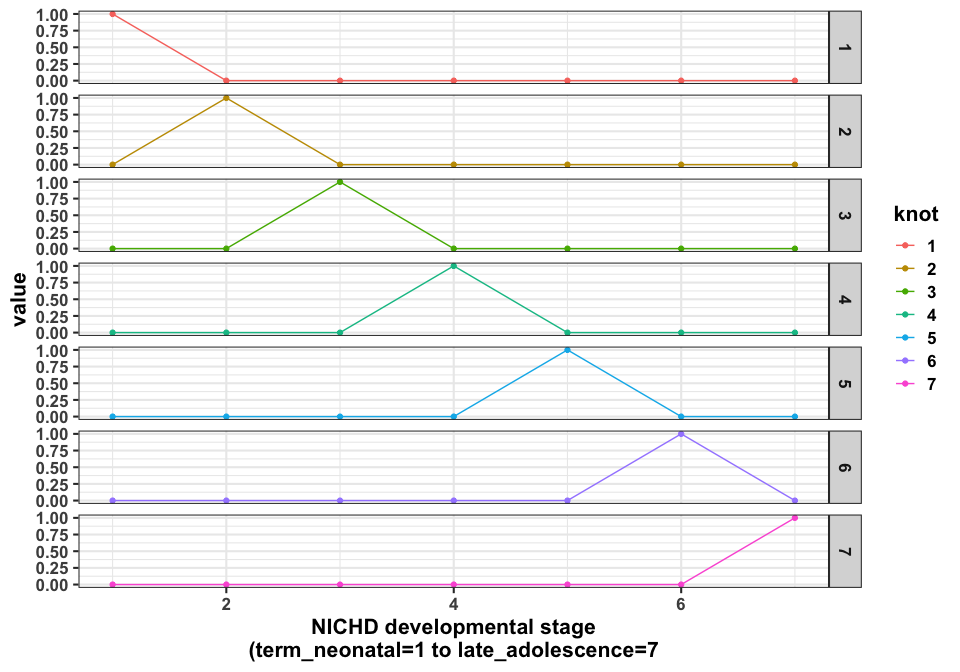

``` r

knots = 1:length(stages)
Xp <- tf.X(knots,knots)

Xp_dt = data.table(Xp)
colnames(Xp_dt) <- knots %>% as.character()
Xp_dt$nichd <- knots
Xp_dt_melt <- 
    Xp_dt %>% 
    melt(id.vars="nichd",
         variable.name="knot")

Xp_dt_melt %>% 
    ggplot(aes(nichd,value,color=knot)) +
    geom_point() +
    geom_line() +
    facet_grid(knot~.) +
  xlab("NICHD developmental stage\n(term_neonatal=1 to late_adolescence=7")
```

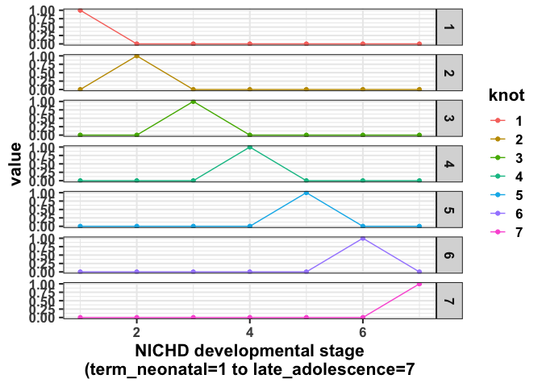

``` r
# https://stats.stackexchange.com/questions/29345/visualizing-a-spline-basis/29346
knots = c(27/365,1,2,6,11,17,19)
x <- report_dat$age
spl <- ns(x,knots=knots)

#sapply(1:ncol(spl),function(i){plot(x,spl[,i],ylab=paste0("Basis ",i),xlab="Age")})

autoplot(spl)
#> Warning: `select_()` is deprecated as of dplyr 0.7.0.
#> Please use `select()` instead.
#> This warning is displayed once every 8 hours.
#> Call `lifecycle::last_warnings()` to see where this warning was generated.
```


``` r

knots=c(1,2,3,4,5,6)
x <- report_dat$nichd %>% as.integer()
spl <- ns(x,knots=knots)

autoplot(spl) +
  xlab("NICHD developmental stage\n(term_neonatal=1 to late_adolescence=7")
```

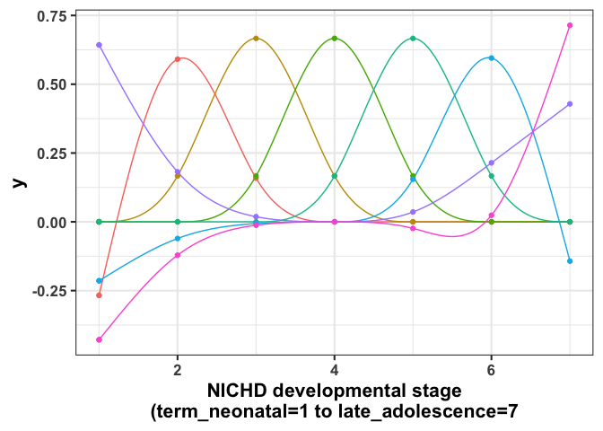

## Generalized additive models

<!-- https://rdrr.io/cran/mgcv/man/smooth.terms.html --->

``` r
gam_datas <- NULL

make_gam_data <- function(mod){
  
  data.table(
    term = names(coef(mod)), 
    coef = coef(mod), 
    se = sqrt(diag(vcov(mod))), 
    aic = mod$aic,
    formula = Reduce(paste, deparse(mod$formula))
    )
  
}

mod = bamV(E ~ D,
           data=report_dat,
           family=binomial(link="logit"),
           method = "fREML",
           aGam=list("discrete"=T))
#> Warning in bam(formula = E ~ D, family = structure(list(family = "binomial", :
#> no smooths, ignoring `discrete=TRUE'

gam_datas <- bind_rows(gam_datas,make_gam_data(mod))

summary(mod)
#> 
#> Family: binomial 
#> Link function: logit 
#> 
#> Formula:
#> E ~ D
#> 
#> Parametric coefficients:
#>             Estimate Std. Error  z value Pr(>|z|)    
#> (Intercept) -6.23294    0.03948 -157.867  < 2e-16 ***
#> DDrug        1.03734    0.12871    8.059 7.67e-16 ***
#> ---
#> Signif. codes:  0 '***' 0.001 '**' 0.01 '*' 0.05 '.' 0.1 ' ' 1
#> 
#> 
#> R-sq.(adj) =  0.000206   Deviance explained = 0.488%
#> -REML = 3.122e+05  Scale est. = 1         n = 339741

print(plot(mod,allTerms = T),pages=1)
```


``` r

mod = bamV(E ~ age,
           data=report_dat,
           family=binomial(link="logit"),
           method = "fREML",
           aGam=list("discrete"=T))
#> Warning in bam(formula = E ~ age, family = structure(list(family = "binomial", :
#> no smooths, ignoring `discrete=TRUE'

gam_datas <- bind_rows(gam_datas,make_gam_data(mod))

summary(mod)
#> 
#> Family: binomial 
#> Link function: logit 
#> 
#> Formula:
#> E ~ age
#> 
#> Parametric coefficients:
#>              Estimate Std. Error z value Pr(>|z|)    
#> (Intercept) -6.861772   0.098045 -69.986  < 2e-16 ***
#> age          0.052314   0.006373   8.209 2.23e-16 ***
#> ---
#> Signif. codes:  0 '***' 0.001 '**' 0.01 '*' 0.05 '.' 0.1 ' ' 1
#> 
#> 
#> R-sq.(adj) =  0.000179   Deviance explained = 0.72%
#> -REML = 3.1221e+05  Scale est. = 1         n = 339741

print(plot(mod,allTerms = T),pages=1)
```


``` r

mod = bamV(E ~ s(age,
                 bs="cs"),
           data=report_dat,
           family=binomial(link="logit"),
           method = "fREML",
           aGam=list("discrete"=T))

gam_datas <- bind_rows(gam_datas,make_gam_data(mod))

summary(mod)
#> 
#> Family: binomial 
#> Link function: logit 
#> 
#> Formula:
#> E ~ s(age, bs = "cs")
#> 
#> Parametric coefficients:
#>             Estimate Std. Error z value Pr(>|z|)    
#> (Intercept) -6.40425    0.05445  -117.6   <2e-16 ***
#> ---
#> Signif. codes:  0 '***' 0.001 '**' 0.01 '*' 0.05 '.' 0.1 ' ' 1
#> 
#> Approximate significance of smooth terms:
#>          edf Ref.df Chi.sq p-value    
#> s(age) 5.866      9  97.49  <2e-16 ***
#> ---
#> Signif. codes:  0 '***' 0.001 '**' 0.01 '*' 0.05 '.' 0.1 ' ' 1
#> 
#> R-sq.(adj) =  0.000367   Deviance explained = 1.64%
#> fREML = 3.1722e+05  Scale est. = 1         n = 339741

print(plot(mod,allTerms = T),pages=1)
```

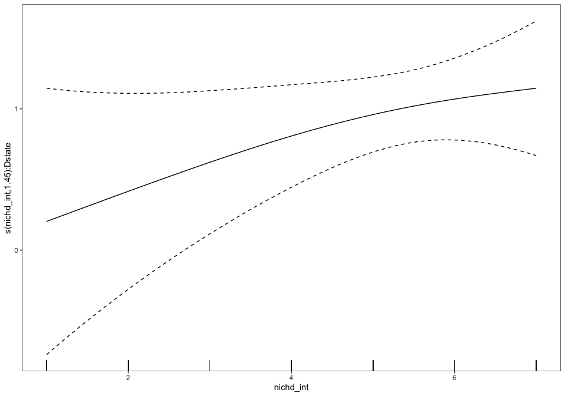

``` r

mod = bamV(E ~ s(age,
                 bs="cs",
                 k=7),
           data=report_dat,
           family=binomial(link="logit"),
           method = "fREML",
           aGam=list("discrete"=T,"knots"=list(x=stage_knots_in_age)))

gam_datas <- bind_rows(gam_datas,make_gam_data(mod))

summary(mod)
#> 
#> Family: binomial 
#> Link function: logit 
#> 
#> Formula:
#> E ~ s(age, bs = "cs", k = 7)
#> 
#> Parametric coefficients:
#>             Estimate Std. Error z value Pr(>|z|)    
#> (Intercept)  -6.4070     0.0546  -117.4   <2e-16 ***
#> ---
#> Signif. codes:  0 '***' 0.001 '**' 0.01 '*' 0.05 '.' 0.1 ' ' 1
#> 
#> Approximate significance of smooth terms:
#>          edf Ref.df Chi.sq p-value    
#> s(age) 5.105      6  97.48  <2e-16 ***
#> ---
#> Signif. codes:  0 '***' 0.001 '**' 0.01 '*' 0.05 '.' 0.1 ' ' 1
#> 
#> R-sq.(adj) =  0.00037   Deviance explained = 1.64%
#> fREML = 3.1722e+05  Scale est. = 1         n = 339741

print(plot(mod,allTerms = T),pages=1)
```


``` r

mod = bamV(E ~ s(age,
                 by=D,
                 bs="cs",
                 k=7),
           data=report_dat,
           family=binomial(link="logit"),
           method = "fREML",
           aGam=list("discrete"=T,"knots"=list(x=stage_knots_in_age)))

gam_datas <- bind_rows(gam_datas,make_gam_data(mod))

summary(mod)
#> 
#> Family: binomial 
#> Link function: logit 
#> 
#> Formula:
#> E ~ s(age, by = D, bs = "cs", k = 7)
#> 
#> Parametric coefficients:
#>             Estimate Std. Error z value Pr(>|z|)    
#> (Intercept) -6.46336    0.05563  -116.2   <2e-16 ***
#> ---
#> Signif. codes:  0 '***' 0.001 '**' 0.01 '*' 0.05 '.' 0.1 ' ' 1
#> 
#> Approximate significance of smooth terms:
#>                       edf Ref.df Chi.sq p-value    
#> s(age):DOther drugs 5.038      6 100.69  <2e-16 ***
#> s(age):DDrug        4.836      6  88.19  <2e-16 ***
#> ---
#> Signif. codes:  0 '***' 0.001 '**' 0.01 '*' 0.05 '.' 0.1 ' ' 1
#> 
#> R-sq.(adj) =  0.000576   Deviance explained = 2.12%
#> fREML = 3.1721e+05  Scale est. = 1         n = 339741

print(plot(mod,allTerms = T),pages=1)
```

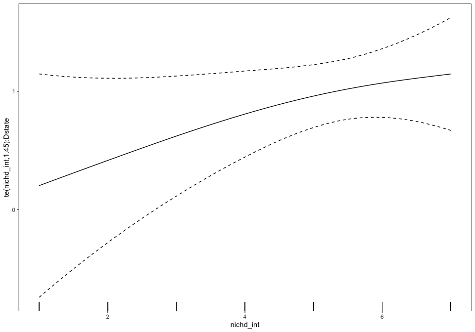

``` r

mod = bamV(E ~ nichd,
           data=report_dat,
           family=binomial(link="logit"),
           method = "fREML",
           aGam=list("discrete"=T))
#> Warning in bam(formula = E ~ nichd, family = structure(list(family =
#> "binomial", : no smooths, ignoring `discrete=TRUE'

gam_datas <- bind_rows(gam_datas,make_gam_data(mod))

summary(mod)
#> 
#> Family: binomial 
#> Link function: logit 
#> 
#> Formula:
#> E ~ nichd
#> 
#> Parametric coefficients:
#>                        Estimate Std. Error z value Pr(>|z|)    
#> (Intercept)             -9.2154     0.9995  -9.220  < 2e-16 ***
#> nichdinfancy             0.9917     1.0950   0.906  0.36512    
#> nichdtoddler             1.7290     1.0602   1.631  0.10294    
#> nichdearly_childhood     2.3567     1.0161   2.319  0.02037 *  
#> nichdmiddle_childhood    3.2735     1.0023   3.266  0.00109 ** 
#> nichdearly_adolescence   3.1383     1.0012   3.135  0.00172 ** 
#> nichdlate_adolescence    3.3061     1.0022   3.299  0.00097 ***
#> ---
#> Signif. codes:  0 '***' 0.001 '**' 0.01 '*' 0.05 '.' 0.1 ' ' 1
#> 
#> 
#> R-sq.(adj) =  0.000288   Deviance explained = 1.42%
#> -REML = 3.1221e+05  Scale est. = 1         n = 339741

print(plot(mod,allTerms = T),pages=1)
```

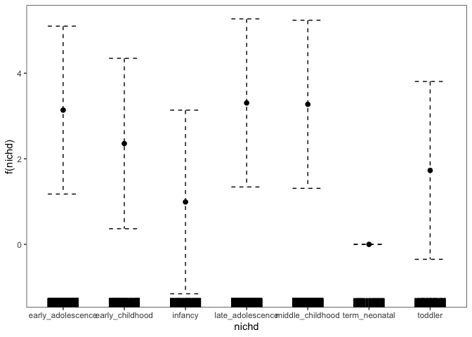

``` r

mod = bamV(E ~ s(nichd_int,
                 bs="cs",
                 k=7),
           data=report_dat,
           family=binomial(link="logit"),
           method = "fREML",
           aGam=list("discrete"=T,"knots"=list(x=1:length(stages))))

gam_datas <- bind_rows(gam_datas,make_gam_data(mod))

summary(mod)
#> 
#> Family: binomial 
#> Link function: logit 
#> 
#> Formula:
#> E ~ s(nichd_int, bs = "cs", k = 7)
#> 
#> Parametric coefficients:
#>             Estimate Std. Error z value Pr(>|z|)    
#> (Intercept)   -7.073      0.144  -49.11   <2e-16 ***
#> ---
#> Signif. codes:  0 '***' 0.001 '**' 0.01 '*' 0.05 '.' 0.1 ' ' 1
#> 
#> Approximate significance of smooth terms:
#>                edf Ref.df Chi.sq p-value    
#> s(nichd_int) 3.784      6  72.56  <2e-16 ***
#> ---
#> Signif. codes:  0 '***' 0.001 '**' 0.01 '*' 0.05 '.' 0.1 ' ' 1
#> 
#> R-sq.(adj) =  0.000291   Deviance explained = 1.41%
#> fREML = 3.1722e+05  Scale est. = 1         n = 339741

print(plot(mod,allTerms = T),pages=1) 
```

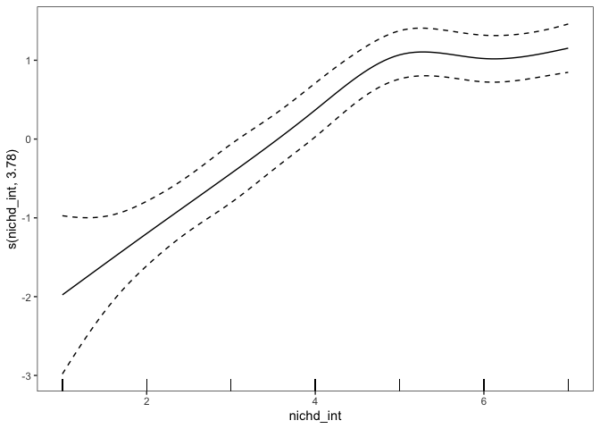

``` r

mod = bamV(E ~ s(nichd_int,
                 by=D,
                 bs="cs",
                 k=7),
           data=report_dat,
           family=binomial(link="logit"),
           method = "fREML",
           aGam=list("discrete"=T,"knots"=list(x=1:length(stages))))

gam_datas <- bind_rows(gam_datas,make_gam_data(mod))

summary(mod)
#> 
#> Family: binomial 
#> Link function: logit 
#> 
#> Formula:
#> E ~ s(nichd_int, by = D, bs = "cs", k = 7)
#> 
#> Parametric coefficients:
#>             Estimate Std. Error z value Pr(>|z|)    
#> (Intercept)  -7.0743     0.1357  -52.12   <2e-16 ***
#> ---
#> Signif. codes:  0 '***' 0.001 '**' 0.01 '*' 0.05 '.' 0.1 ' ' 1
#> 
#> Approximate significance of smooth terms:
#>                             edf Ref.df Chi.sq p-value    
#> s(nichd_int):DOther drugs 3.602      6  73.09  <2e-16 ***
#> s(nichd_int):DDrug        2.694      6 106.83  <2e-16 ***
#> ---
#> Signif. codes:  0 '***' 0.001 '**' 0.01 '*' 0.05 '.' 0.1 ' ' 1
#> 
#> R-sq.(adj) =  0.000473   Deviance explained = 1.83%
#> fREML = 3.1721e+05  Scale est. = 1         n = 339741

print(plot(mod,allTerms = T),pages=1)
```


``` r

gam_datas %>% 
  .[order(term)] %>% 
  ggplot(aes(coef,term,color=formula)) + 
  geom_point(size=4) + 
  theme(legend.position = "none") + 
  facet_wrap(formula~.,scales="free")
```

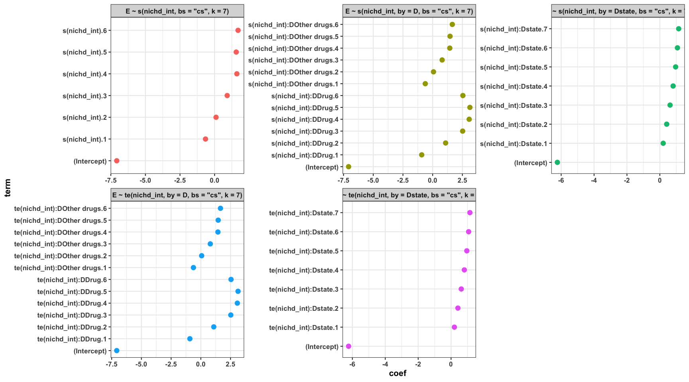

``` r

gam_datas %>% 
  ggplot(aes(aic,formula)) + 
  geom_point(size=4)
```


