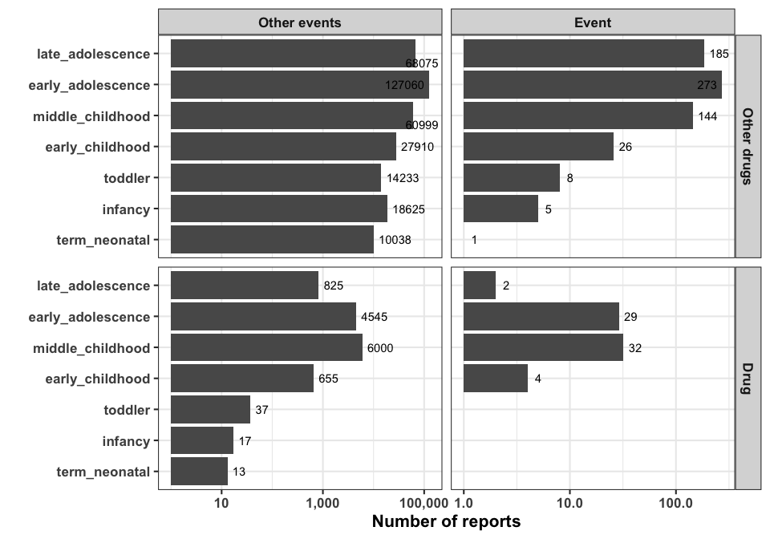
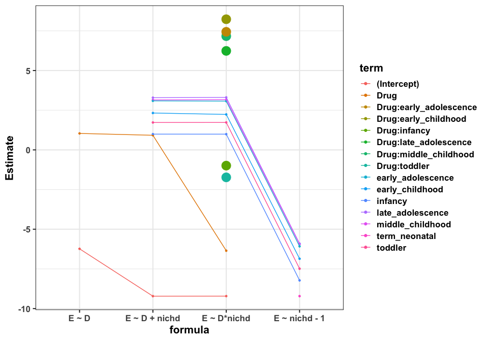
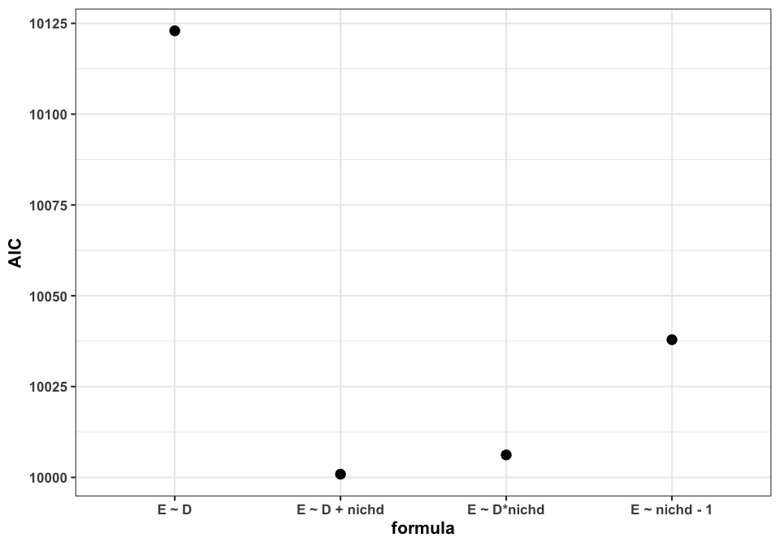
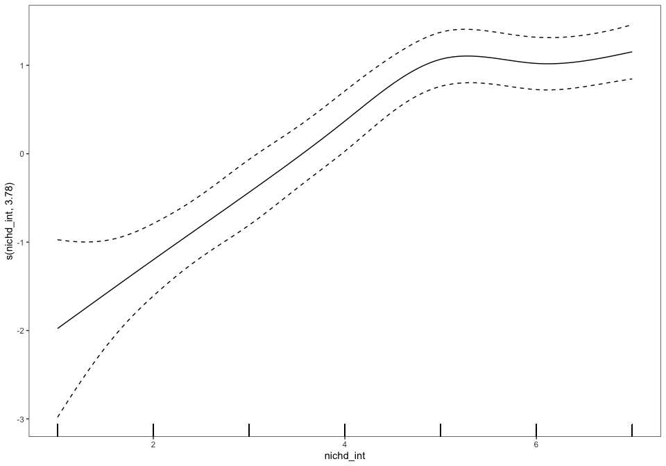

<!-- README.md is generated from README.Rmd. Please edit that file -->

<style type="text/css">
body{ /* Normal  */
      font-size: 20px;
  }
}
</style>

# gamworkshop

<!-- badges: start -->

<!-- badges: end -->

The goal of gamworkshop is to …

``` r
library(gamworkshop)
library(pacman)

p_load(data.table,tidyverse,knitr,splines,ggfortify,mgcv,ggrepel,mgcViz)

stage_knots_in_age <- c(27/365,1,2,5,11,18,21)

theme_set(theme_bw(base_size = 16) + theme(text = element_text(face="bold")))
```

# Punchline

Generalized additive models show improved nonlinear associations both in
interpretation and fit compared to linear models.

# Introduction

Oftentimes we want to understand the relationship between a
characteristic and an outcome. Modeling techniques are a great way to
understand relationship between a characteristic (i.e. independent
variable, covariate) and an outcome (i.e. dependent variable, response).

In my work, I want to evaluate a characteristic’s relationship to the
outcome in a way that doesn’t bias the type of relationship it naturally
may have. This is because I want to let the data *tell me* what the
relaionship may be. In particular, I am interested in how an adverse
event i.e. side effect is related to a drug exposure during childhood.
More specifically, I want to understand how the occurrence of a side
effect may change across child development stages.

In this tutorial, I will show how generalized additive models are a
flexible yet interpretable way to model relationships in a population
and have advantages over traditionally used methods.

# Outline

  - Question
    
      - Setup the question to be investigated.

  - Data
    
      - Display the data to be used to answer the question

  - Relationship between outcome and characteristic
    
      - Show different ways of visualizing the data as well as the
        relationship between the outcome and characteristic.

  - Modeling
    
      - Different modeling strategies to investigate the relationship.
        Each strategy or method will be generally explained with
        examples.
    
      - Logistic Regression
    
      - Regression Spline
    
      - Generalized Additive Model

# Question

Which population model shows a quantitatively improved association
between an adverse event with a drug as it is given at child
developmental stages?

[Child developmental
stages](https://www.researchgate.net/profile/Katrina_Williams8/publication/230612139/figure/tbl2/AS:601671696650242@1520461119208/Age-Stages-Defined-According-to-NICHD-Pediatric-Terminology.png)

# Data

I made an R package that stores the FDA’s reports collected from
clinical trials, lawyers, doctors, pharma companies, etc., specifically
on the occurrence of Methylphenidate exposure and Paranoia. This is a
known adverse drug
effect<sup>[1](http://doi.wiley.com/10.1111/j.1475-3588.2008.00490.x),[2](http://pediatrics.aappublications.org/cgi/doi/10.1542/peds.2008-0185)</sup>,
with a mechanism of inhibiting dopamine
neurons<sup>[3](http://link.springer.com/10.1007/s11065-006-9017-3)</sup>
and having long term side effects change brain chemistry and
signaling<sup>[4](https://linkinghub.elsevier.com/retrieve/pii/S0197018618303905)</sup>.

I have over 300,000 reports of all drugs and side effects reported for
over 3 decades, with the reports with Methylephenidate and Paranoia
labeled as shown below:

``` r

data("report_dat") 
report_dat$D <- factor(report_dat$D,levels=c("Other drugs","Drug"))
report_dat$E <- factor(report_dat$E,levels=c("Other events","Event"))

report_dat <- 
  report_dat %>% 
  .[order(age)]

stages = c("term_neonatal","infancy","toddler","early_childhood","middle_childhood","early_adolescence","late_adolescence")
report_dat$nichd <- factor(report_dat$nichd,levels=stages)
report_dat$nichd_int <- report_dat$nichd %>% as.integer()

dim(report_dat)
#> [1] 339741      9

report_dat[1:5] %>% 
    kable("simple")
```

| safetyreportid |       age | year | nichd          | D           | E            | Dstate | Estate | nichd\_int |
| :------------- | --------: | ---: | :------------- | :---------- | :----------- | -----: | -----: | ---------: |
| 5826490-5      | 0.0001142 |    0 | term\_neonatal | Other drugs | Other events |      0 |      0 |          1 |
| 6329603-4      | 0.0001142 |    0 | term\_neonatal | Other drugs | Other events |      0 |      0 |          1 |
| 8764023        | 0.0001142 |    0 | term\_neonatal | Other drugs | Other events |      0 |      0 |          1 |
| 8764680        | 0.0001142 |    0 | term\_neonatal | Other drugs | Other events |      0 |      0 |          1 |
| 8764925        | 0.0001142 |    0 | term\_neonatal | Other drugs | Other events |      0 |      0 |          1 |

# Relationship between Paranoia and report characteristics

The question is to understand the relationship of Paranoia reporting as
a function of Methylphenidate reporting and at what childhood stage it
was reported in. I can first look at how many reports were reported for
Methylphenidate and/or Psychosis:

``` r

report_dat[,.N,.(nichd,D,E)] %>% 
  ggplot(aes(N,nichd)) +
  geom_bar(stat="identity") +
  geom_text_repel(aes(label=N),nudge_x=0.1) +
  facet_grid(D~E,scales="free") +
  scale_x_continuous(trans="log10",label=scales::comma) +
  xlab("Number of reports") +
  ylab("")
```



The bottom right panel is what I’m really interested in. It shows
there’s only reports of Methylphenidate and Paranoia from early
childhood to late adolescence.

Now, in normal pharmacovigilance activitiews like this, the association
is often quantified as the event prevalence ratio between when the drug
was reported and when it was not:

``` r

tab <- report_dat[,table(D,E)]
prr <- 
  (tab["Drug","Event"] / ( tab["Drug","Event"] + tab["Drug","Other events"] ) ) / 
  (tab["Other drugs","Event"] / (tab["Other drugs","Event"] + tab["Other drugs","Other events"]) )

tab <- report_dat[,table(D,E)]
prr <- function(tab){
  
  (tab["Drug","Event"] / ( tab["Drug","Event"] + tab["Drug","Other events"] ) ) / 
  (tab["Other drugs","Event"] / (tab["Other drugs","Event"] + tab["Other drugs","Other events"]) )
  
}

prr_df <- 
data.table(
  nichd = stages,
  PRR = sapply(stages,function(x){prr(report_dat[nichd==x,table(D,E)])})
) 

prr_df %>% 
  ggplot(aes(factor(nichd,levels=stages),PRR)) +
  geom_bar(stat="identity") +
  xlab("") +
  ggtitle(paste0("Overall Childhood PRR: ",round(prr(tab),2)))
```


We see that the PRR says that there is an overall association between
reporting of Methylphenidate and Paranoia. This is not surprising from
what we know mechanistically. But we see this value is different at the
child developmental stages, suggesting this relationship is dependent on
when the drug was taken/reported.

However, this is still limited by observations. What is meant is that if
there are no observations of Methylphenidate and Paranoia reported
together, then the PRR cannot be calculated.

We can suppose that even though we don’t observe an assocviation, there
is still a nontrivial risk of the side effect if a child were to take
Methylphenidate. This is where modeling strategies come into play.

# Modeling

Population modeling techniques allow for using all available data to fit
a model or hypothesis of the relationship between a characteristic and
an outcome.

## Logistic Regression

Logistic regression is an extremely popular approach for this type of
binary association.

Basically, this linear model is an equation of a line \(Y = mx + b\).
However, to make the equattion work with a binary \(Y\), we transform
the equation which I’m not going to show here but can be easily found
online. In the logit versus high school math parlance, the equation is

<center>

\(Y = \beta*X + \beta_0\)

</center>

where \(Y\) is the log odds of the probable association with Paranoia
versus not Paranoia, \(\beta\) is the coefficient value of the
association with the characteristic(s), and \(\beta_0\) is the intercept
term of the proclivity of the population of reports to contain Paranoia
versus not Paranoia when Methylphenidate is not reported.

The characteristics we want is the child development stages with
Methylphenidate reported. the model specification should be an
interaction between the two. Below I’m showing the coefficients for
different model specifications and the AIC of the model, which is a way
to quantitatively assess how well the data is fit by the model given how
it was specified - more characteristics in the model will let the model
fit the data better, but too many characteristics makes the model
complicated. the AIC is a quantified form of that tradeoff.

``` r

glm_coef <- function(form="E ~ D - 1",id="id"){
    formula=as.formula(form)
    mod <- glm(formula,data=report_dat,family=binomial(link="logit"))
    summ <- summary(mod)
    dt <- summ$coefficients %>% data.table()
    dt$formula <- form
    dt$term <- summ$coefficients %>% rownames() %>% str_replace("D","") %>% str_replace("nichd",'')
    dt$id=id
    dt$aic <- mod$aic
    dt
}

glm_coefs <- 
    bind_rows(
        glm_coef("E ~ D",id='model1'),
        glm_coef("E ~ nichd - 1",id='model2'),
        glm_coef("E ~ D + nichd",id='model3'),
        glm_coef("E ~ D*nichd",id='model4')
        )

glm_coefs$size = ifelse(stringr::str_detect(glm_coefs$term,":"),2,1)

glm_coefs %>% 
  ggplot(aes(formula,Estimate,color=term,group=term)) +
  geom_point(aes(size=size)) +
  geom_line() +
  scale_size(guide="none")
```



``` r

cbind(glm_coefs[id=="model2"],prr_df) %>% 
  ggplot(aes(Estimate,PRR,color=nichd)) + 
  geom_point()
```


``` r

glm_coefs[,.(nterms = .N),.(formula,aic)] %>% 
  ggplot(aes(formula,aic)) +
  geom_point(size=4) +
  ylab("AIC")
```



We see that the associations change depending on the model
specifications.

There really isn’t a correlation between the PRR values and the model
values, and we would like there to be.

The model that seems to fit the data well and not be as complex is the
model where we evaluate whether Methylphenidate was reported and what
child stage the subject of the report is, follwed by the interaction
which we’re interested in.

This is not ideal since we want more or less the PRR and model
coefficients to relate and to be nonnegative. (That’s mostly because I
took out the intercept, but with it we can’t quantify the association to
the neonatal stage easily).

## Polynomial Regression

Polynomial regression is the next step to allow fitting nonlinear
associations of characteristic(s). We can iteratively add more degrees
of freedom, or more ways for the line to break, to make an association.

``` r
# http://www.science.smith.edu/~jcrouser/SDS293/labs/lab12-r.html
fit_plot_polynomial <- function(degree=3){
    fit = glm(Estate ~ poly(nichd_int, degree), data = report_dat,family = binomial(link="logit"))
    preds = predict(fit, newdata = list(nichd_int = 1:7), se = TRUE)
    pfit = exp(preds$fit) / (1+exp(preds$fit))
    se_bands_logit = cbind("upper" = preds$fit+2*preds$se.fit, 
                           "lower" = preds$fit-2*preds$se.fit)
    se_bands = exp(se_bands_logit) / (1+exp(se_bands_logit))
    
    E = report_dat[E=="Event"]
    
    notE = report_dat[E=="Other events"]
    
    coefs = sapply(coef(fit)[2:(degree+1)],function(x){round(x,2)})
    formula = 
        paste0("Event ~ ",paste0(sapply(1:degree,function(x){paste0(coefs[x]," * nichd^",x)}),collapse=" + "))
    
    ggplot() +
      geom_rug(data = notE, aes(x = jitter(nichd_int), y = max(pfit)), sides = "b", alpha = 0.1) +
      geom_rug(data = E, aes(x = jitter(nichd_int), y = min(pfit)), sides = "t", alpha = 0.1) +
      geom_line(aes(x = 1:7, y = pfit), color = "#0000FF") +
      geom_ribbon(aes(x = 1:7, 
                      ymin = se_bands[,"lower"], 
                      ymax = se_bands[,"upper"]), 
                  alpha = 0.3) +
      labs(title = paste0(formula,"\nAIC=",round(fit$aic,0)),
           x = "NICHD",
           y = "P(Event)")
}

fit_plot_polynomial(1)
```


``` r
fit_plot_polynomial(2)
```


``` r
fit_plot_polynomial(3)
```


``` r
fit_plot_polynomial(4)
```


``` r
fit_plot_polynomial(5)
```


``` r
fit_plot_polynomial(6)
```


Visually it looks great. But the AIC values are not better than those
from the Logistic regression. Also, the coefficients are really low so
it’s really hard to interpret these values. Also also, we can’t
intuitively add drug reporting interaction into this model because of
the need to multiply this factor into every coefficient degree which
doesn’t make sense.

This is also not the greatest model to use.

## Regression splines

Regression splines are not too often used in this area of study but seem
promising. They inherently model flexibility in the associations. The
idea is to ‘stitch’ together individual bases or components of the
association function:

``` r

# Simon Wood's Intro to GAMs textbook chapter 4

tf <- function(x,xj,j){
    ## generate the jth tent function from set defined by knots xj
    dj <- xj*0;dj[j] <- 1
    ## linearly interpolates between xj and dj taking place at x
    approx(xj,dj,x)$y
}

tf.X <- function(x,xj){
    ## tent function basis matrix given data X
    ## and knot sequence xk
    nk <- length(xj); n <- length(x)
    X <- matrix(NA,n,nk)
    for(j in 1:nk) X[,j] <- tf(x,xj,j)
    X
}

knots = 1:length(stages)
Xp <- tf.X(knots,knots)

Xp_dt = data.table(Xp)
colnames(Xp_dt) <- knots %>% as.character()
Xp_dt$nichd <- knots
Xp_dt_melt <- 
    Xp_dt %>% 
    melt(id.vars="nichd",
         variable.name="knot")

Xp_dt_melt %>% 
    ggplot(aes(nichd,value,color=knot)) +
    geom_point() +
    geom_line() +
    facet_grid(knot~.) +
  xlab("NICHD developmental stage\n(term_neonatal=1 to late_adolescence=7")
```


These bases or components can have different shapes. Below we show what
they look like if one uses what’s called cubic splines. Basically, the
functions connect together in a smooth
way.

``` r
# https://stats.stackexchange.com/questions/29345/visualizing-a-spline-basis/29346
knots=c(1,2,3,4,5,6)
x <- report_dat$nichd %>% as.integer()
spl <- ns(x*report_dat$Dstate,knots=knots,intercept=F,Boundary.knots=c(0,7))

autoplot.basis.custom <- function(object) {
    fortified <- ggplot2::fortify(object)
    all.knots <- c(attr(object, "Boundary.knots"),
                   attr(object, "knots")) %>%
        unname %>% sort
    knot.df <- ggplot2::fortify(object,
                                data=all.knots)
    #knot.df$nichd <- factor(knot.df$Spline,labels = stages)
    #fortified$nichd <- factor(fortified$Spline,labels = stages)
    
    #knot.df %>% ggplot(aes(x,y,color=Spline)) + geom_point() + geom_line()
    ggplot(fortified) +
        aes_string(x="x", y="y", group="Spline", color="Spline") +
        geom_line() +
        geom_point(data=knot.df) +
      scale_color_brewer(palette="Set1") +
      guides(color=guide_legend(title="Basis"))
}


autoplot.basis.custom(spl)
#> Warning: `select_()` is deprecated as of dplyr 0.7.0.
#> Please use `select()` instead.
#> This warning is displayed once every 8 hours.
#> Call `lifecycle::last_warnings()` to see where this warning was generated.
```


As you can see, the basis functions are calculated at different knots
(i.e. points in the data range) and they are made smooth by the cubic
penalty in the function. The shapes look kind of funky, but that’s ok
because this is just for illustration purposes.

## Generalized additive models

<!-- https://rdrr.io/cran/mgcv/man/smooth.terms.html --->

``` r
gam_datas <- NULL

make_gam_data <- function(mod){
  
  data.table(
    term = names(coef(mod)), 
    coef = coef(mod), 
    se = sqrt(diag(vcov(mod))), 
    aic = mod$aic,
    formula = Reduce(paste, deparse(mod$formula))
    )
  
}

mod = bamV(E ~ s(nichd_int,
                 bs="cs",
                 k=7),
           data=report_dat,
           family=binomial(link="logit"),
           method = "fREML",
           aGam=list("discrete"=T,"knots"=list(x=1:length(stages))))

gam_datas <- bind_rows(gam_datas,make_gam_data(mod))

summary(mod)
#> 
#> Family: binomial 
#> Link function: logit 
#> 
#> Formula:
#> E ~ s(nichd_int, bs = "cs", k = 7)
#> 
#> Parametric coefficients:
#>             Estimate Std. Error z value Pr(>|z|)    
#> (Intercept)   -7.073      0.144  -49.11   <2e-16 ***
#> ---
#> Signif. codes:  0 '***' 0.001 '**' 0.01 '*' 0.05 '.' 0.1 ' ' 1
#> 
#> Approximate significance of smooth terms:
#>                edf Ref.df Chi.sq p-value    
#> s(nichd_int) 3.784      6  72.56  <2e-16 ***
#> ---
#> Signif. codes:  0 '***' 0.001 '**' 0.01 '*' 0.05 '.' 0.1 ' ' 1
#> 
#> R-sq.(adj) =  0.000291   Deviance explained = 1.41%
#> fREML = 3.1722e+05  Scale est. = 1         n = 339741
coef(mod)
#>    (Intercept) s(nichd_int).1 s(nichd_int).2 s(nichd_int).3 s(nichd_int).4 
#>     -7.0730716     -0.6568175      0.1061056      0.9116325      1.6109951 
#> s(nichd_int).5 s(nichd_int).6 
#>      1.5638585      1.6955762

print(plot(mod,allTerms = T),pages=1) 
```



``` r

mod = bamV(E ~ s(nichd_int,
                 by=D,
                 bs="cs",
                 k=7),
           data=report_dat,
           family=binomial(link="logit"),
           method = "fREML",
           aGam=list("discrete"=T,"knots"=list(x=1:length(stages))))

gam_datas <- bind_rows(gam_datas,make_gam_data(mod))

summary(mod)
#> 
#> Family: binomial 
#> Link function: logit 
#> 
#> Formula:
#> E ~ s(nichd_int, by = D, bs = "cs", k = 7)
#> 
#> Parametric coefficients:
#>             Estimate Std. Error z value Pr(>|z|)    
#> (Intercept)  -7.0743     0.1357  -52.12   <2e-16 ***
#> ---
#> Signif. codes:  0 '***' 0.001 '**' 0.01 '*' 0.05 '.' 0.1 ' ' 1
#> 
#> Approximate significance of smooth terms:
#>                             edf Ref.df Chi.sq p-value    
#> s(nichd_int):DOther drugs 3.602      6  73.09  <2e-16 ***
#> s(nichd_int):DDrug        2.694      6 106.83  <2e-16 ***
#> ---
#> Signif. codes:  0 '***' 0.001 '**' 0.01 '*' 0.05 '.' 0.1 ' ' 1
#> 
#> R-sq.(adj) =  0.000473   Deviance explained = 1.83%
#> fREML = 3.1721e+05  Scale est. = 1         n = 339741
coef(mod)
#>                 (Intercept) s(nichd_int):DOther drugs.1 
#>                 -7.07433310                 -0.62093333 
#> s(nichd_int):DOther drugs.2 s(nichd_int):DOther drugs.3 
#>                  0.07095162                  0.79688501 
#> s(nichd_int):DOther drugs.4 s(nichd_int):DOther drugs.5 
#>                  1.43941398                  1.46163209 
#> s(nichd_int):DOther drugs.6        s(nichd_int):DDrug.1 
#>                  1.65300484                 -0.92099138 
#>        s(nichd_int):DDrug.2        s(nichd_int):DDrug.3 
#>                  1.08994755                  2.52309839 
#>        s(nichd_int):DDrug.4        s(nichd_int):DDrug.5 
#>                  3.07257364                  3.13266582 
#>        s(nichd_int):DDrug.6 
#>                  2.54251392

print(plot(mod,allTerms = T),pages=1)
```


``` r

mod = bamV(E ~ s(nichd_int,
                 by=Dstate,
                 bs="cs",
                 k=7),
           data=report_dat,
           family=binomial(link="logit"),
           method = "fREML",
           aGam=list("discrete"=T,"knots"=list(x=1:length(stages))))

gam_datas <- bind_rows(gam_datas,make_gam_data(mod))

summary(mod)
#> 
#> Family: binomial 
#> Link function: logit 
#> 
#> Formula:
#> E ~ s(nichd_int, by = Dstate, bs = "cs", k = 7)
#> 
#> Parametric coefficients:
#>             Estimate Std. Error z value Pr(>|z|)    
#> (Intercept)  -6.2301     0.0394  -158.1   <2e-16 ***
#> ---
#> Signif. codes:  0 '***' 0.001 '**' 0.01 '*' 0.05 '.' 0.1 ' ' 1
#> 
#> Approximate significance of smooth terms:
#>                       edf Ref.df Chi.sq p-value    
#> s(nichd_int):Dstate 1.453      7   61.9  <2e-16 ***
#> ---
#> Signif. codes:  0 '***' 0.001 '**' 0.01 '*' 0.05 '.' 0.1 ' ' 1
#> 
#> R-sq.(adj) =  0.000201   Deviance explained = 0.483%
#> fREML = 3.1727e+05  Scale est. = 1         n = 339741
coef(mod)
#>           (Intercept) s(nichd_int):Dstate.1 s(nichd_int):Dstate.2 
#>            -6.2300516             0.2033574             0.4160990 
#> s(nichd_int):Dstate.3 s(nichd_int):Dstate.4 s(nichd_int):Dstate.5 
#>             0.6215634             0.8077020             0.9593449 
#> s(nichd_int):Dstate.6 s(nichd_int):Dstate.7 
#>             1.0692920             1.1458343

print(plot(mod,allTerms = T),pages=1)
```


``` r

mod = bamV(E ~ te(nichd_int,
                 by=D,
                 bs="cs",
                 k=7),
           data=report_dat,
           family=binomial(link="logit"),
           method = "fREML",
           aGam=list("discrete"=T,"knots"=list(x=1:length(stages))))

gam_datas <- bind_rows(gam_datas,make_gam_data(mod))

summary(mod)
#> 
#> Family: binomial 
#> Link function: logit 
#> 
#> Formula:
#> E ~ te(nichd_int, by = D, bs = "cs", k = 7)
#> 
#> Parametric coefficients:
#>             Estimate Std. Error z value Pr(>|z|)    
#> (Intercept)  -7.0743     0.1357  -52.12   <2e-16 ***
#> ---
#> Signif. codes:  0 '***' 0.001 '**' 0.01 '*' 0.05 '.' 0.1 ' ' 1
#> 
#> Approximate significance of smooth terms:
#>                              edf Ref.df Chi.sq p-value    
#> te(nichd_int):DOther drugs 3.602      6  73.09  <2e-16 ***
#> te(nichd_int):DDrug        2.694      6 106.83  <2e-16 ***
#> ---
#> Signif. codes:  0 '***' 0.001 '**' 0.01 '*' 0.05 '.' 0.1 ' ' 1
#> 
#> R-sq.(adj) =  0.000473   Deviance explained = 1.83%
#> fREML = 3.1721e+05  Scale est. = 1         n = 339741
coef(mod)
#>                  (Intercept) te(nichd_int):DOther drugs.1 
#>                  -7.07433310                  -0.62093333 
#> te(nichd_int):DOther drugs.2 te(nichd_int):DOther drugs.3 
#>                   0.07095162                   0.79688501 
#> te(nichd_int):DOther drugs.4 te(nichd_int):DOther drugs.5 
#>                   1.43941398                   1.46163209 
#> te(nichd_int):DOther drugs.6        te(nichd_int):DDrug.1 
#>                   1.65300484                  -0.92099138 
#>        te(nichd_int):DDrug.2        te(nichd_int):DDrug.3 
#>                   1.08994755                   2.52309839 
#>        te(nichd_int):DDrug.4        te(nichd_int):DDrug.5 
#>                   3.07257364                   3.13266581 
#>        te(nichd_int):DDrug.6 
#>                   2.54251392

print(plot(mod,allTerms = T),pages=1)
```


``` r

mod = bamV(E ~ te(nichd_int,
                 by=Dstate,
                 bs="cs",
                 k=7),
           data=report_dat,
           family=binomial(link="logit"),
           method = "fREML",
           aGam=list("discrete"=T,"knots"=list(x=1:length(stages))))

gam_datas <- bind_rows(gam_datas,make_gam_data(mod))

summary(mod)
#> 
#> Family: binomial 
#> Link function: logit 
#> 
#> Formula:
#> E ~ te(nichd_int, by = Dstate, bs = "cs", k = 7)
#> 
#> Parametric coefficients:
#>             Estimate Std. Error z value Pr(>|z|)    
#> (Intercept)  -6.2301     0.0394  -158.1   <2e-16 ***
#> ---
#> Signif. codes:  0 '***' 0.001 '**' 0.01 '*' 0.05 '.' 0.1 ' ' 1
#> 
#> Approximate significance of smooth terms:
#>                        edf Ref.df Chi.sq p-value    
#> te(nichd_int):Dstate 1.453      7   61.9  <2e-16 ***
#> ---
#> Signif. codes:  0 '***' 0.001 '**' 0.01 '*' 0.05 '.' 0.1 ' ' 1
#> 
#> R-sq.(adj) =  0.000201   Deviance explained = 0.483%
#> fREML = 3.1727e+05  Scale est. = 1         n = 339741
coef(mod)
#>            (Intercept) te(nichd_int):Dstate.1 te(nichd_int):Dstate.2 
#>             -6.2300516              0.2033574              0.4160990 
#> te(nichd_int):Dstate.3 te(nichd_int):Dstate.4 te(nichd_int):Dstate.5 
#>              0.6215634              0.8077020              0.9593449 
#> te(nichd_int):Dstate.6 te(nichd_int):Dstate.7 
#>              1.0692920              1.1458343

print(plot(mod,allTerms = T),pages=1)
```


``` r

gam_datas %>% 
  .[order(term)] %>% 
  ggplot(aes(coef,term,color=formula)) + 
  geom_point(size=4) + 
  theme(legend.position = "none") + 
  facet_wrap(formula~.,scales="free")
```


``` r

gam_datas %>% 
  ggplot(aes(aic,formula)) + 
  geom_point(size=6)
```


The GAM is flexible not just in its ability to calculate individual
functions for each knot given (i.e. the contribution of the data range
to the response) but it also allows for forming many types of
specifications of associations.

The AIC for the cubic spline interaction is actually the lowest of any
model we generated, which points to this being a more appropriate model.
But the coefficients for this momdel don’t mapp to every stage unlike
the spline interaction model with the drug as a factor.

``` r

bind_rows(
  gam_datas[formula=="E ~ s(nichd_int, by = Dstate, bs = \"cs\", k = 7)",
          .(term,coef,aic,formula="E ~ s(nichd_int, by = Dstate, bs = \"cs\", k = 7)")],
  gam_datas[formula=="E ~ s(nichd_int, by = D, bs = \"cs\", k = 7)",
          .(term,coef,aic,formula="E ~ s(nichd_int, by = D, bs = \"cs\", k = 7)")]
) %>% 
  ggplot(aes(coef,term,color=formula)) +
  geom_point() +
  facet_grid(~formula,scales ="free") +
  theme(
    legend.position = "bottom"
  )
```


But good thing is they look very similar so even though the model
doesn’t have the lowest AIC the estimated coefficients are similar.
